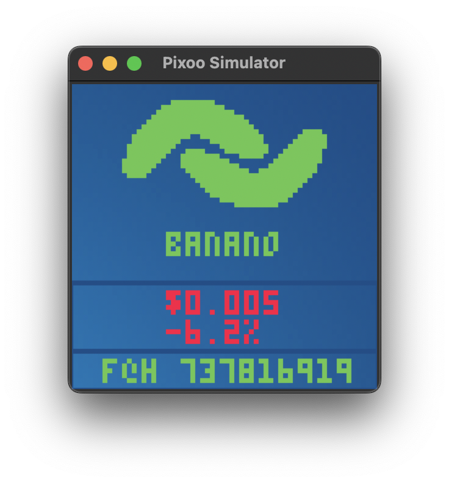

# Pixoo

A library to easily communicate with the Divoom Pixoo 64 (and hopefully soon more screens that support Wi-Fi)

A simple working example application using this "rendering" framework can be found
here: https://github.com/SomethingWithComputers/pixoo-banano

Tested on a Pixoo 64, with Python 3.10 on MacOS Monterey.

## The all new ✨Simulator✨

.. Simulator might be a bit of a big word, but if you want to test your own drawing stuff,
I've included a simple "simulator" that can render the buffer to a GUI so it's easier to debug without having to connect
to the device.

It's in a very early stage, but it supports all methods that start with `draw_` and can be "pushed" to the GUI, just
the way you'd use it normally.

**NOTE:** When enabling and using the simulator, the actual connection to the device will be completely ignored. So
don't expect to see anything on your device when simulating.

The simulator can be activated as such:

```python
pixoo = Pixoo('192.168.1.137', simulated=True, simulation_config=SimulatorConfig(4))
```

The SimulatorConfig *currently* only takes one argument, which is the `scale` to display the images at. Should be 1 or a
multiple of 2 if you want nice looking results. It seems like 4 and 8 are working great, in my experience. With `scale`
set to 4 it'll look like this on MacOS:



## Installation

You can install the pixoo package as developer locally with next command running from cloned folder:

```shell
python -m pip install -e .
```

Or Simply install the required dependencies via PIP. Navigate to the directory where you installed this library. Then
execute:

```shell
pip3 install -r requirements.txt
```

Install the requirements.txt via pip install

On some newer versions of MacOS, if you want to use the simulator you might have to manually install the `tkinter`
library. I use brew:

```shell
brew install python-tk
```

## Getting started

Create an interface with your device as such (of course use your own local IP-address):

```python
pixoo = Pixoo('192.168.1.137')
```

For now, the easiest way to learn how to use this library is to check the `examples.py`, and the example directory for a
neat project. I'll be adding examples to this page over time as well, once the project matures a bit more.

**NOTE:** Be sure to call `push()` after performing all your draw actions, to push the internal buffer to the screen. *
Try to not call this method more than once per second if you don't want the device to stop responding!*

### Usage

#### Stability increase

Use the `refresh_connection_automatically` boolean variable in the constructor of `Pixoo` to force a reset of the
internal
counter on the device. This should
make the application much more stable at the expensive of a slight delay in updating every 32 frames.
I haven't tested it myself just yet, but theoretically this would solve
the `"After updating the screen +/- 300 times the
display stops responding"` bug.

## Special thanks

### PICO-8's fantastic low-res font

Special thanks goes to the fantastic [PICO-8](https://www.lexaloffle.com/pico-8.php) and its creator. I've written a
small script to convert the font to simple pixel matrixes, which are used as "glyphs" within the `draw_text` methods.

Supported characters so far are:

```
0123456789
abcdefghijklmnopqrstuvwxyz
ABCDEFGHIJKLMNOPQRSTUVWXYZ
!'()+,-<=>?[]^_:;./{|}~$@%
```

## Known bugs

### Previous buffer/image is still partially visible

Unfortunately, the Divoom Pixoo 64 doesn't seem quite ready for prime time- *yet*. There are some known buffer issues
that can cause issues, basically meaning that parts of the previous image are still displayed even though a newer image
has been pushed to the display. I'm sure this will be fixed in the future though, the dev team seems to be working hard!

### After updating the screen +/- 300 times the display stops responding

This seems to be an internal bug with the current firmware. I'll update the code once a better way to push a buffer to
the screen becomes available.

### TextScrollDirection.RIGHT seems to invert the string

.. and some other issues. Seems like for now, text can only really be scrolling left with most fonts. This will likely (
hopefully?) be fixed by the dev team in the future.
